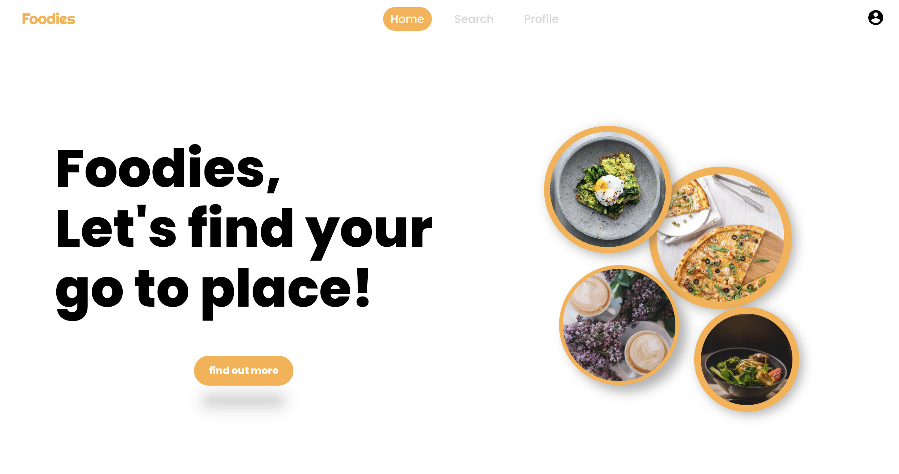

# Foodies

Concordia Bootcamp Final Project

## Description

I am a food lover, when I know I could decide what I want to do for my final project, I decided right away that I want to create a an app about restaurants, and here it is!
This project is made during the final two weeks of Concordia Bootcamp study. The technologies involved are React, Node, Express, MongoDB, and YelpApi.
( all styles were created with pure css, no libraries )

### A little DEMO
https://user-images.githubusercontent.com/93296331/173446192-250f1ae7-0f7a-45c2-9868-8768b4d481d6.mov

### Home page

