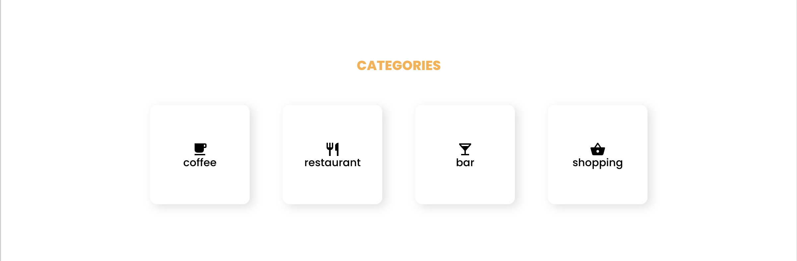
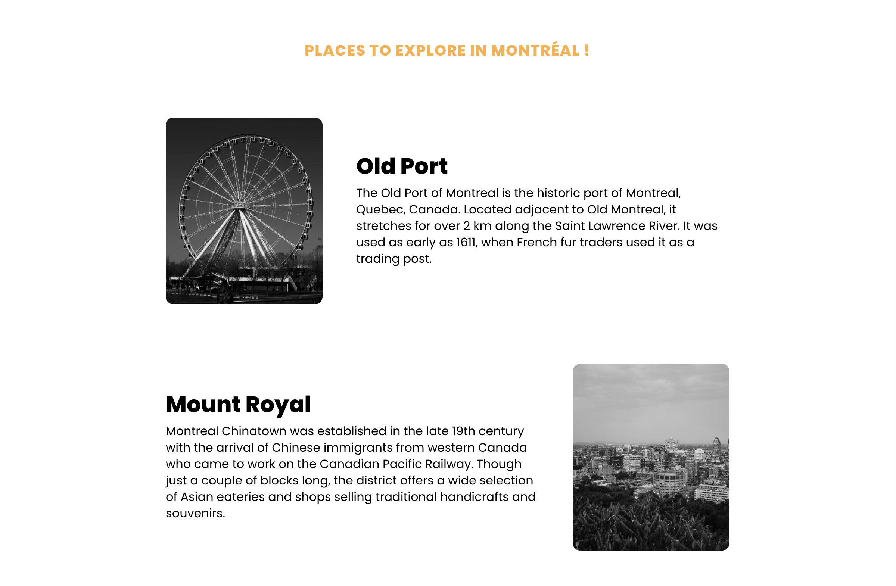
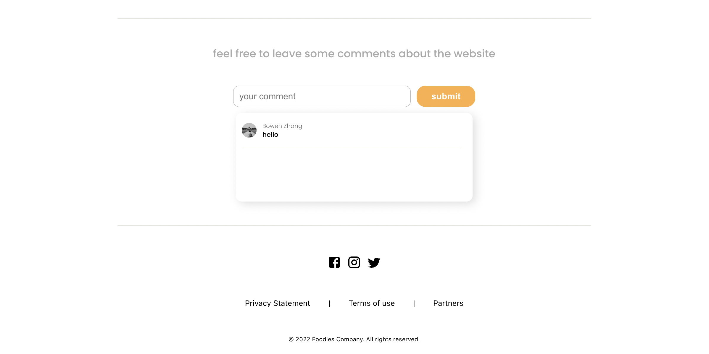

# Foodies

Concordia Bootcamp Final Project

## Description

I am a food lover, when I know I could decide what I want to do for my final project, I decided right away that I want to create a an app about restaurants, and here it is!
This project is made during the final two weeks of Concordia Bootcamp study. The technologies involved are React, Node, Express, MongoDB, and YelpApi.
( all styles were created with pure css, no libraries )

### A little DEMO

### Home page

You can find more restaurants after clicking the 'find out more' button

### Categories section

You can find restaurants with different categories

### A few famous pleace in montreal

### comments section

Users can leave comments

